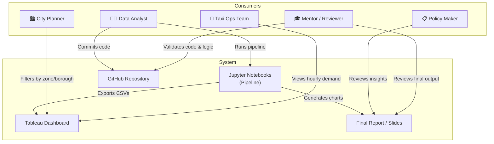
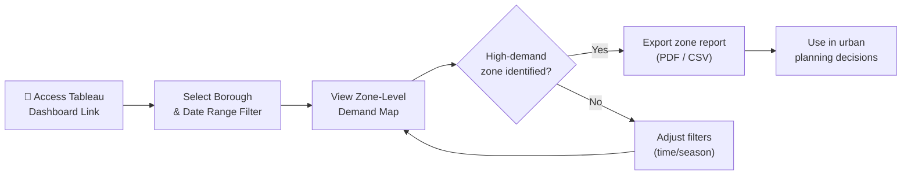
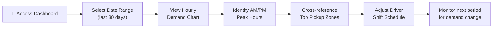
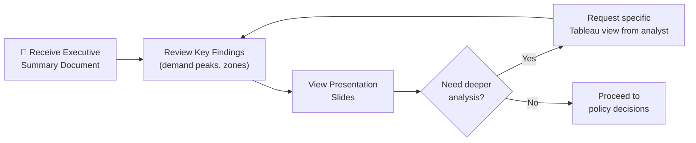
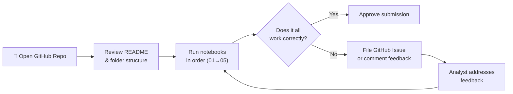

# Consumer Flow Diagram
## Urban Taxi Demand Pattern Analysis

**Project:** Urban Taxi Demand Pattern &nbsp;|&nbsp; **Dataset:** NYC TLC Trip Records

---

## 1. Who Uses This System?

Not everyone interacts with the project the same way. A policy maker doesn't need to run a Jupyter Notebook — they just want the key findings on a slide. A taxi operations manager cares about peak hours, not statistical skewness. We've mapped five distinct personas who all consume the outputs of this pipeline in different ways.

| Consumer | Their Role | How They Primarily Interact |
|---|---|---|
| **Data Analyst** (Shivaansh / Prantik) | Builds and runs the full pipeline | Jupyter Notebooks + GitHub |
| **City Mobility Planner** | Looks at zone-level demand to guide infrastructure decisions | Tableau Dashboard |
| **Taxi Operations Team** | Uses demand data to optimise driver allocation and shift planning | Dashboard – Hourly Demand View |
| **Policy Maker** | Makes high-level transport decisions based on summarised insights | Final Report / Presentation |
| **Mentor / Reviewer** | Validates the methodology and assesses the project quality | GitHub Repo + Executive Summary |

---

## 2. The Big Picture — How Everyone Connects

---

## 3. Individual Journeys

### 3.1 The Data Analyst (That's Us)

This is the most involved flow. We start from scratch — downloading the data, running every notebook, building the dashboard, and finally publishing the results.

```mermaid
flowchart LR
    S1["🌐 Visit NYC TLC Page"] --> S2["📥 Download Parquet Files\n(Yellow + Green)"]
    S2 --> S3["▶️ Run 01_data_ingestion.ipynb"]
    S3 --> S4["▶️ Run 02_data_cleaning.ipynb"]
    S4 --> S5["▶️ Run 03_eda.ipynb\n(Review EDA charts)"]
    S5 --> S6["▶️ Run 04_statistical_analysis.ipynb\n(Review distributions)"]
    S6 --> S7["▶️ Run 05_dashboard_export.ipynb"]
    S7 --> S8["📊 Open Tableau\nImport CSV exports"]
    S8 --> S9["🎨 Build Dashboard Views\n(Hourly, Zone, Monthly)"]
    S9 --> S10["📤 Publish Dashboard\n+ Push to GitHub"]
```

---

### 3.2 The City Mobility Planner

They arrive at a shareable Tableau link, apply filters relevant to their borough or time period of interest, and walk away with a zone-level insight they can use in urban planning conversations.

---

### 3.3 The Taxi Operations Team

They're focused on a practical question: when and where should drivers be deployed? They use the hourly demand chart and zone rankings to fine-tune shift schedules.

---

### 3.4 The Policy Maker

They're unlikely to open Tableau themselves. They receive the executive summary, review the key findings, and either move forward with a policy decision or ask the analyst team for a deeper dive on a specific question.

---

### 3.5 The Mentor / Reviewer

They approach the project like a technical audit — cloning the repo, checking the structure, running the notebooks, and validating that the methodology is sound. If something's off, they raise feedback and the cycle repeats.

---

## 4. Quick Reference — Who Goes Where

| Consumer | Entry Point | What They Do | What They Walk Away With |
|---|---|---|---|
| Data Analyst | TLC website / GitHub | Runs the full pipeline end-to-end | A published dashboard and clean codebase |
| City Planner | Tableau link | Filters by zone and date | A zonal insight for infrastructure planning |
| Taxi Ops Team | Tableau link | Views the hourly demand chart | An optimised driver shift schedule |
| Policy Maker | Emailed PDF / slides | Reads the summary findings | A data-backed basis for transport decisions |
| Mentor | GitHub repo link | Reviews code and reruns notebooks | Project approval or actionable feedback |
