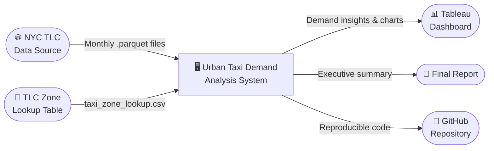
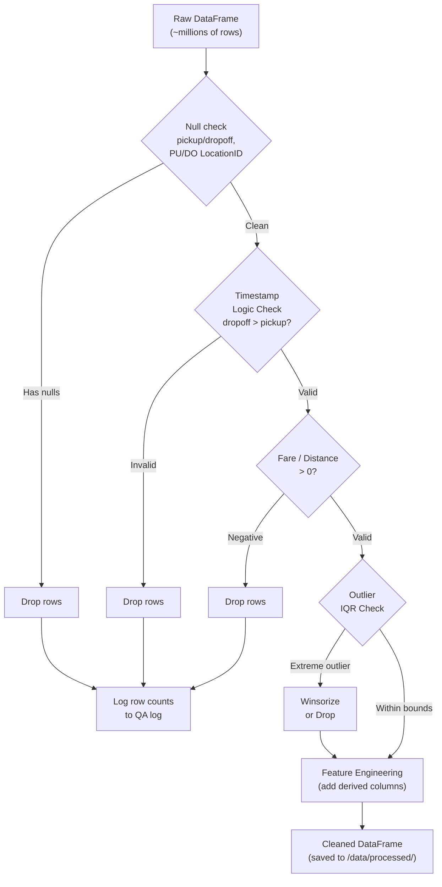
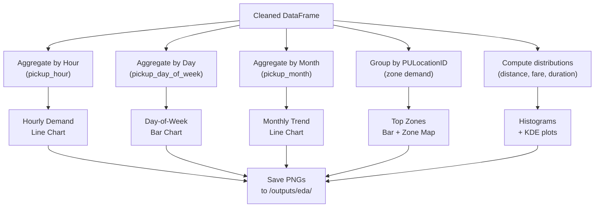
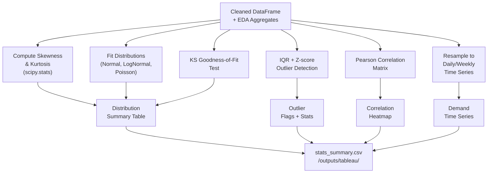
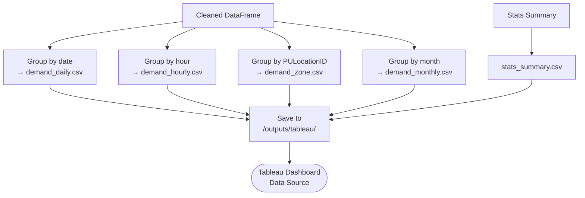

# Data Flow Diagram (DFD)
## Urban Taxi Demand Pattern Analysis

**Project:** Urban Taxi Demand Pattern &nbsp;|&nbsp; **Dataset:** NYC TLC Trip Records

---

## Overview

The data flow diagram traces the life of a single row of taxi trip data — from the moment it's downloaded off the NYC TLC website, all the way to the number that appears on a Tableau dashboard or in a summary report. We use three levels of detail to tell this story, starting broad and zooming in.

---

## Level 0 — The Big Picture

At the highest level, our system takes in raw trip data from two external sources and produces three outputs: an interactive dashboard, a final report, and a reproducible GitHub repository.



---

## Level 1 — Inside the System

Zoom in and the system becomes a five-stage pipeline. Data flows through ingestion, cleaning, analysis, and then gets packaged up for the dashboard and report.

```mermaid
flowchart TD
    DS1(["NYC TLC\nYellow+Green .parquet"]) --> P1["P1\nData Ingestion"]
    DS2(["Zone Lookup\n.csv"]) --> P1
    P1 -->|Raw DataFrame| DS3[("D1\nRaw Data Store\n/data/raw/")]
    DS3 --> P2["P2\nData Cleaning\n& Validation"]
    P2 -->|Cleaned DataFrame| DS4[("D2\nProcessed Store\n/data/processed/")]
    P2 -->|Cleaning logs| DS5[("D5\nQA Logs")]
    DS4 --> P3["P3\nExploratory\nData Analysis"]
    DS4 --> P4["P4\nStatistical\nAnalysis"]
    P3 -->|EDA charts (.png)| DS6[("D3\nOutputs/EDA")]
    P4 -->|Distribution params\n& outlier flags| DS7[("D4\nAnalysis Results")]
    DS6 --> P5["P5\nAggregation\n& Export"]
    DS7 --> P5
    DS4 --> P5
    P5 -->|Aggregated CSVs| DS8[("D6\nTableau Exports\n/outputs/tableau/")]
    DS8 -->|Import| DASH(["Tableau Dashboard"])
    DS6 -->|Embedded charts| RPT(["Final Report / Slides"])
    DS7 -->|Stats summary| RPT
```

---

## Level 2 — What Happens Inside Each Stage

### Stage 2: Data Cleaning

This is the most critical stage — garbage in, garbage out. Every row is passed through a series of checks. Anything that fails gets dropped and logged. Only clean, valid rows continue downstream.



---

### Stage 3: Exploratory Data Analysis

The cleaned data is sliced and aggregated in five different ways. Each slice becomes a chart that gets saved and eventually embedded in the report.



---

### Stage 4: Statistical Analysis

This stage goes deeper than charts. We mathematically describe the shape of the data — fitting distributions, testing how well they fit, hunting for outliers, and checking how variables relate to each other.



---

### Stage 5: Aggregation & Export

The final stage rolls everything up into flat CSV files that Tableau can ingest directly. One file per dimension — hourly, daily, by zone, and by month.



---

## Data Dictionary — Key Flows

Here's a reference for every major data handoff in the pipeline:

| Data Flow | From | To | Format | Key Fields |
|---|---|---|---|---|
| Raw Parquet | TLC CDN | `/data/raw/` | `.parquet` | All original TLC columns |
| Cleaned Parquet | Cleaning notebook | `/data/processed/` | `.parquet` | Original + derived columns |
| QA Log | Cleaning notebook | Console & log file | `.txt` | Step name, rows before/after |
| EDA Charts | EDA notebook | `/outputs/eda/` | `.png` | Visual outputs only |
| Daily Demand | Export notebook | `/outputs/tableau/` | `.csv` | `date`, `trip_count` |
| Hourly Demand | Export notebook | `/outputs/tableau/` | `.csv` | `hour`, `day`, `trip_count` |
| Zone Demand | Export notebook | `/outputs/tableau/` | `.csv` | `PULocationID`, `zone`, `trip_count` |
| Stats Summary | Analysis notebook | `/outputs/tableau/` | `.csv` | `feature`, `mean`, `std`, `skew`, `kurtosis` |

---

## Quality Controls We Built In

We didn't want data issues slipping through unnoticed. Here's what we do to keep things honest:

| What We Check | How We Check It |
|---|---|
| Row counts before cleaning | `log_row_counts()` called at the start of each cleaning step |
| Row counts after cleaning | Logged again at the end so we can see how many rows were removed and why |
| Distribution fit quality | If the KS test p-value is below 0.05, the fit is flagged as poor in the summary table |
| Tableau data integrity | Nulls are filtered out before CSV export so the dashboard never shows blank cards |
| Cross-month consistency | Final notebook compares row totals across months to catch any obvious anomalies |
