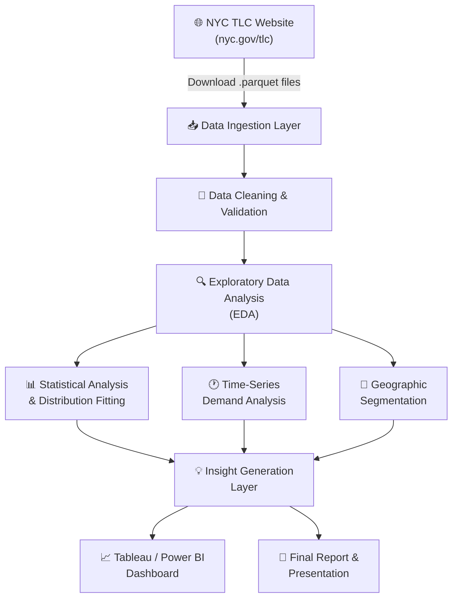

# High-Level Design (HLD)
## Urban Taxi Demand Pattern Analysis

**Project:** Urban Taxi Demand Pattern &nbsp;|&nbsp; **Dataset:** NYC TLC Trip Records
**Team:** Shivaansh Pandey & Prantik &nbsp;|&nbsp; **Mentor:** Navneet Nautiyal


## 1. What Are We Building?

Urban taxi demand is anything but uniform — it spikes on Monday mornings, dips on Sunday afternoons, and shifts dramatically depending on the neighbourhood. The goal of this project is to make sense of those patterns by digging into the **NYC Taxi & Limousine Commission (TLC) trip records**.

We analyse Yellow and Green taxi data (stored in the efficient `.parquet` format) to uncover when, where, and how often people are hailing cabs across New York City. The end result is a set of clean, visual, and stakeholder-ready insights — delivered through a Tableau dashboard and a final report.

The architecture is entirely **batch-based** (we work with historical data, there's no live stream), which keeps things manageable and reproducible on a regular laptop.




## 2. How the System Is Structured

Think of the project as an assembly line — each stage hands off clean, enriched data to the next. Here's a quick breakdown of what each layer does:

| Layer | Tool / Component | What It Does |
|---|---|---|
| **Ingestion** | TLC Downloader | Pulls monthly `.parquet` files (Yellow & Green taxi) from the NYC TLC CDN |
| **Storage** | Local file system | Holds both the original raw files and the cleaned versions we produce |
| **Processing** | Jupyter Notebooks | Where most of the heavy lifting happens — cleaning, transforming, exploring |
| **Analysis** | SciPy + Pandas | Fits statistical distributions, catches outliers, and measures skewness |
| **Visualisation** | Matplotlib / Seaborn | Produces the charts you'll see in the notebooks and the final report |
| **Dashboard** | Tableau / Power BI | The polished, filter-friendly face of the project for stakeholders |
| **Version Control** | Git + GitHub | Keeps everything tracked, reproducible, and shareable |
| **Reporting** | PDF / Slides | The executive summary and final presentation deck |

---

## 3. Where Does the Data Come From?

We work with four main data sources. The bulk of the analysis runs on the two primary sources (Yellow and Green taxi trips), while the reference tables help us add geographic meaning to the raw location IDs.

| Source | Type | Format | What It Covers |
|---|---|---|---|
| Yellow Taxi Trip Records | Primary | `.parquet` (monthly) | One row per trip — the main dataset |
| Green Taxi Trip Records | Primary | `.parquet` (monthly) | Outer-borough taxi trips |
| Taxi Zone Lookup Table | Reference | `.csv` | Maps 265 zone IDs to named neighbourhoods |
| Taxi Zone Shapefile | Reference | `.zip` | Borough boundaries for geographic visualisation |

**The fields we care about most:**
- `tpep_pickup_datetime` / `lpep_pickup_datetime` — tells us *when* demand happened
- `PULocationID` / `DOLocationID` — tells us *where* trips started and ended
- `trip_distance` — for understanding how far people actually travel
- `fare_amount`, `total_amount` — for revenue-side analysis
- `passenger_count` — an indicator of ride-sharing patterns

---

## 4. The Technology Stack

Nothing exotic here — just the standard Python data science toolkit, paired with Tableau for the final dashboard.

```
Language:         Python 3.10+
Data Wrangling:   Pandas, NumPy
Statistical:      SciPy (distribution fitting, skewness/kurtosis)
Visualisation:    Matplotlib, Seaborn
Dashboard:        Tableau Public / Power BI
Notebooks:        Jupyter Notebook / JupyterLab
Version Control:  Git + GitHub
Data Format:      Apache Parquet (via PyArrow / fastparquet)
```

---

## 5. Why Did We Make These Choices?

A few decisions were made deliberately — here's the thinking behind them:

| Decision | Why We Made It |
|---|---|
| Parquet instead of CSV | Monthly trip files have 10M+ rows. Parquet reads them much faster and takes up far less disk space |
| Batch processing | Since we're studying historical patterns, real-time ingestion would add complexity without any benefit |
| Separate notebooks per stage | Easier to debug, easier to re-run individual steps, and cleaner to present |
| Zone-level geography | NYC's 265 TLC zones give us meaningful granularity without needing to render complex shapefiles mid-analysis |
| Tableau for the dashboard | It's intuitive for non-technical stakeholders and lets them explore the data themselves with filters |

---

## 6. What We Need the System to Handle

Beyond just working, the system needs to hold up under a few practical constraints:

| Requirement | What That Means in Practice |
|---|---|
| **Scalability** | Should comfortably handle 3–12 months of Yellow + Green data (roughly 30–120 million rows) |
| **Reproducibility** | Anyone who clones the repo should be able to run every step and get the same results |
| **Performance** | Each notebook should complete in under 10 minutes on a standard laptop |
| **Accuracy** | Every cleaning step logs how many rows were dropped, so nothing disappears silently |
| **Portability** | Runs fully offline — no cloud setup required |

---

## 7. How These Documents Fit Together

```
HLD  ──────────────►  This document — the big picture
LLD  ──────────────►  The detailed "how" — modules, functions, schemas
Consumer Flow  ──►  Who uses this system and how they interact with it
Data Flow  ────────►  The journey every row of data takes, end to end
```
